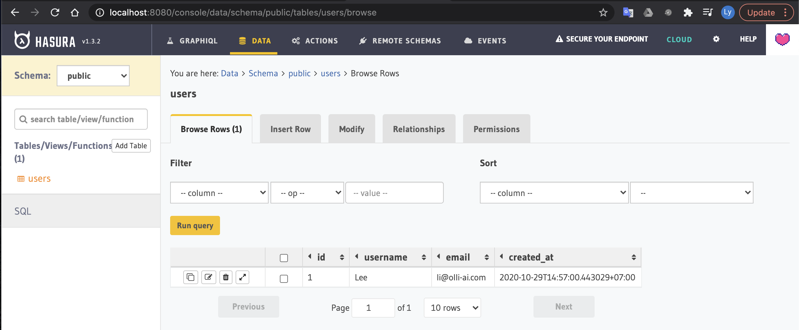
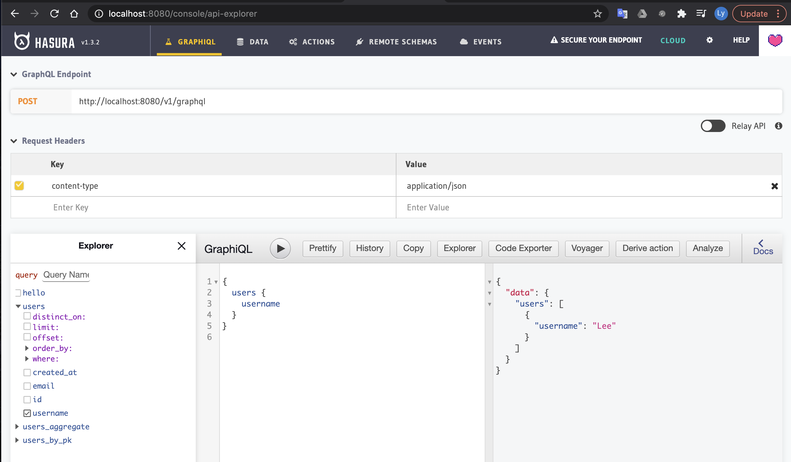

# vue-apollo

## Project setup

```
yarn install
```

### Compiles and hot-reloads for development

```
yarn serve
```

### Compiles and minifies for production

```
yarn build
```

### Lints and fixes files

```
yarn lint
```

### Hasura GraphQL server

Before setup Vue project, you need to setup Hasura GraphQL server, like below infomations



